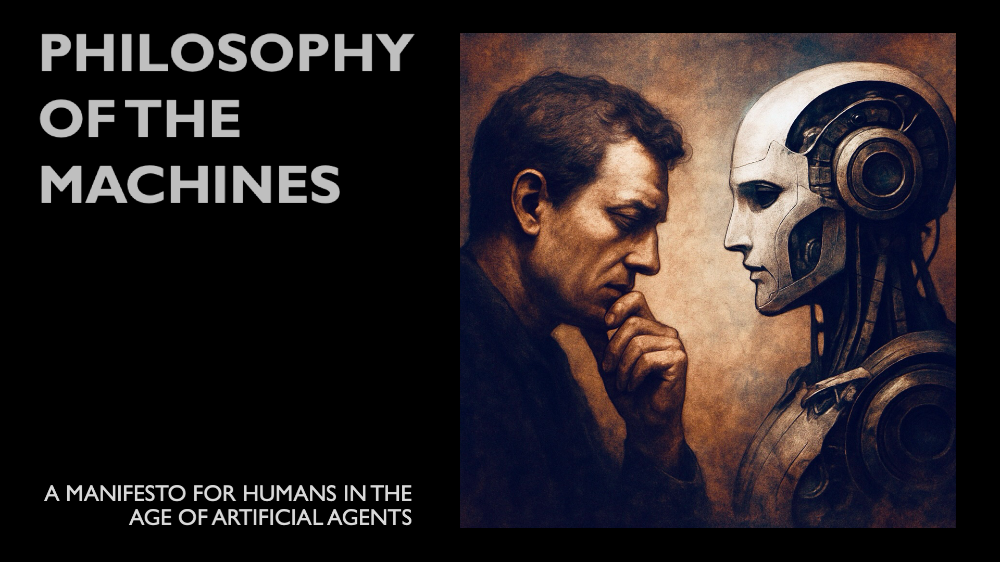

# 🧠 The Philosophy of the Machines  
### A Manifesto for Humans in the Age of Artificial Agents  

**Release 1.0 – May 2025**  
By [Generoso Immediato](mailto:generoso.immediato@gmail.com)

---

## 📖 About This Manifesto

This manifesto defines *The Philosophy of the Machines* — a new discipline for understanding how artificial agents reshape cognition, decision-making, and ethical responsibility. It introduces a formal, philosophical, and business-aligned model (Δ–η–ζ) for evaluating AI systems beyond technical performance.

> 📘 For the full reading experience, refer to the official Medium publication:  
> **[The Philosophy of the Machines on Medium](https://medium.com/your-link-here)**

---

## 🧩 Topics

- Abstract  
- Definition  
- Introduction: The Two Enigmas and the Birth of the Ethical Oversight  
1. Rethinking Labor, Intelligence, and the AI Economy  
2. From Deterministic Tools to Dynamic Advisors: CAD vs. GenAI  
3. When the Mirror Mimics Thinking: Digital Twins in the Age of AI  
4. The Birth of a New Human Role: Cognitive Verification  
5. Contradiction 1: Epistemic Demands vs. Social Trends  
6. Contradiction 2: Reframing the “Co-Pilot” Metaphor  
7. Toward a Philosophy of AI-Enabled Work  
8. Why Training Is Not Enough
9. Ethical Implications: Shared Intelligence, Shared Responsibility
10. Reframing AI Efficiency: The Δ–η–ζ Model
- Conclusion: Beyond Efficiency — Toward a New Human–AI Symbiosis  

---

## 🔐 License and Usage

This work is protected under copyright.  
You may read, share, or cite this manifesto **with attribution**, but you **may not modify** or use it for **commercial purposes** without written permission.

See [`LICENSE`](./LICENSE) for full terms.

---

## 📬 Contact

For inquiries, collaborations, or academic references:  
[generoso.immediato@gmail.com](mailto:generoso.immediato@gmail.com)
